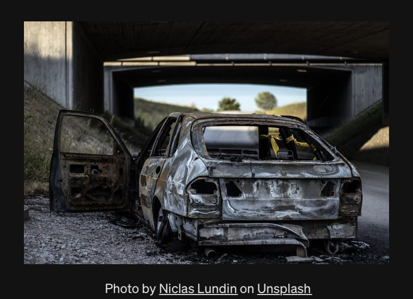

# Road-Accident-Analysis

## Analysis of Road Accident in Various Cities in the UK

 

### Project Overview 
This project provides an in-depth analysis of a dataset centered on road accidents, with a focus on understanding the factors contributing to accidents, the locations with higher incident rates, and potential areas for enhanced road safety measures. By examining the data on road accident occurrences in various cities in the UK, this study aims to uncover patterns to inform targeted interventions and improve road safety outcomes.

### Tool Used
Excel

### Steps Covered
1. Compiling questions to be answered
2. Data cleaning
3. Data processing through addition of custom columns
4. Data analysis using pivot tables and Excel functions
5. Data visualization / Dashboard creation using Excel

### Scenario Used
As a transportation safety analyst tasked with improving road safety, the city authorities provided me with an extensive accident dataset covering a specific timeframe of 2021-2022. The goal is to analyze the data to uncover trends, patterns, and critical factors influencing casualties. They want actionable insights to inform targeted interventions, allocate resources efficiently, and enhance overall traffic safety.

### Exploratory Data Analysis 
This involved exploring the road accident data to answer key questions such as: 

1. Total Casualties taken place after the accident

2. Total Casualties & percentage of total with respect to accident severity and maximum casualties by type of vehicle

3. Total Casualties with respect to vehicle type

4. Monthly trend showing comparison of casualties for the Current Year and Previous Year

5. Maximum Casualties by Road Type

6. Distribution of total casualties by Road Surface

7. Relation between Casualties by Area/ Location & by Day/ Night

### Results/Insights gained:

- With a total of 417, 882 casualties where 2% make up fatal casualties, 14% make up serious casualties, and 84% make up slight casualties, the data indicates that cars are the most common vehicle type involved in road accidents, with a substantial 79.80% share of total casualties.

- Unsurprisingly, it is observed that the majority of casualties, over 309,697 in total, occurred on single carriageways, constituting 74.11% of all casualties.
               
- The data shows that urban areas are associated with a higher number of road accident casualties compared to rural areas, comprising 255,864 reported, representing 61% of the total.
This could be because urban environments are characterized by higher population density, increased traffic congestion, and a greater number of pedestrians, factors that contribute to a higher likelihood of accidents.

- A trend noticed in this analysis is that there is a notable increase in accidents during the autumn months of October and November in both years. 

### Recommendations 
Based on the analysis, I recommend the following actions:

- There should be more focus on urban road safety initiatives, including traffic management, pedestrian safety, and public transport improvement, to reduce the higher incidence of accidents in urban areas.

- Ensure regular road maintenance, particularly during seasons like autumn when slippery road conditions are prevalent. 

- Launch comprehensive public awareness campaigns focusing on safe driving practices, the dangers of driving under adverse conditions, and how to drive during the autumn season especially.

- Invest in infrastructure improvements, particularly in areas with high accident rates, particularly Single carriage-way.

- Continuous Data Collection to minimize unknown road surface conditions and improve the accuracy of future analyses.

